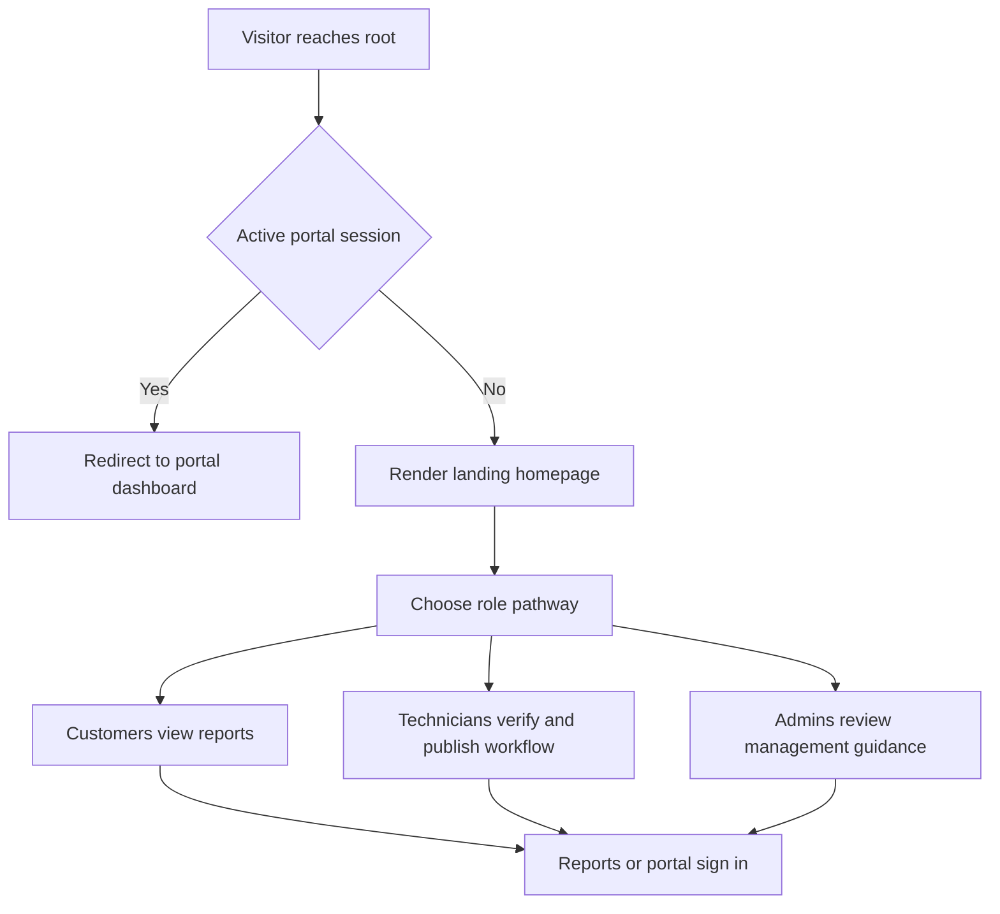

# Merge Plan: `testweb.html` + `index.html` into a single cohesive `index.html`

## Confirmed constraints

- Base visual system: `testweb.html`
- Output target: overwrite `index.html`
- Scope: landing page only
- Worker safety: no direct behavior changes to `report-worker.js` or `admin-worker.js`
- Redirect behavior: remains in `portal-worker.js` root handler
- Audience model: equal pathways for customers, technicians, and admins
- Specificity level: customer-friendly language, low internal platform jargon

## Existing behavior alignment

Current `/` handling in `portal-worker.js` already supports your intent:

- If root-site host and portal session exists, redirect to `/portal`
- Else render homepage content

This means `index.html` can remain presentation-only while routing/auth decisions stay server-side.

## Proposed merged page architecture for `index.html`

Use `testweb.html` styling and layout primitives, but replace/reshape content blocks as follows.

1. **Header and global CTA row**
   - Keep clean brand/header shell from `testweb.html`
   - Primary nav anchors:
     - Overview
     - Role pathways
     - Security and access
     - Service requests
     - Contact
   - CTA hierarchy:
     - Primary: View Reports
     - Secondary: Portal Sign In

2. **Hero: clear landing intent**
   - Position as trusted report access and service coordination
   - Keep non-technical copy
   - Hero CTAs:
     - View Reports
     - Portal Sign In
   - Add compact reassurance points:
     - Fast report access
     - Secure customer portal
     - Clear service-request path

3. **Role Pathways section**
   - Three equal cards, same visual weight:
     - For Customers
     - For Technicians
     - For Administrators
   - Each card has:
     - short outcome statement
     - what they can do
     - next-step CTA or guidance link

4. **Public vs Secure Access section**
   - Non-technical explanation:
     - Public reports are easy to view
     - Secure customers are guided to authenticated access
   - Keep wording user-facing, not KV or token internals
   - CTA: Portal Sign In

5. **Service Request section**
   - Clarify that service requests are available from report experiences
   - Keep promise realistic and operational
   - CTA strategy:
     - If direct route is not finalized, use guidance CTA and avoid dead links

6. **Admin Reassignment messaging section**
   - Explain benefits in plain language:
     - records remain consistent
     - organization can be updated as facilities evolve
   - Avoid deep implementation details
   - No admin-worker coupling in landing logic

7. **Contact and footer**
   - Keep clean contact panel from `testweb.html`
   - Include report and portal links in footer quick actions

## Route and CTA mapping (safe, existing-first)

- **View Reports** → `/reports`
- **Portal Sign In** → `/portal/login`
- **Portal Home after session** → `/portal` via existing root/session behavior
- **Service request** → messaging-led CTA unless a stable direct route is explicitly confirmed

## Content strategy principles

- Customer-friendly, low-jargon phrasing
- Role-based clarity over feature dumping
- Keep claims aligned with live worker behavior
- No references that imply worker changes already happened

## Draft flow diagram

## Implementation handoff checklist for Code mode

1. Backup or snapshot current `index.html`
2. Start from `testweb.html` markup and style tokens
3. Replace section copy and structure per architecture above
4. Ensure all CTAs use confirmed existing routes only
5. Verify no script logic in `index.html` attempts auth redirect
6. Keep accessibility basics:
   - landmarks
   - heading hierarchy
   - focus-visible states
7. Smoke test links:
   - `/reports`
   - `/portal/login`
   - internal anchors
8. Confirm zero edits to worker files in this merge step

## Out of scope for this merge step

- New worker routes
- Token logic refactors
- CTA backend behavior redesign
- Admin or report worker modifications

